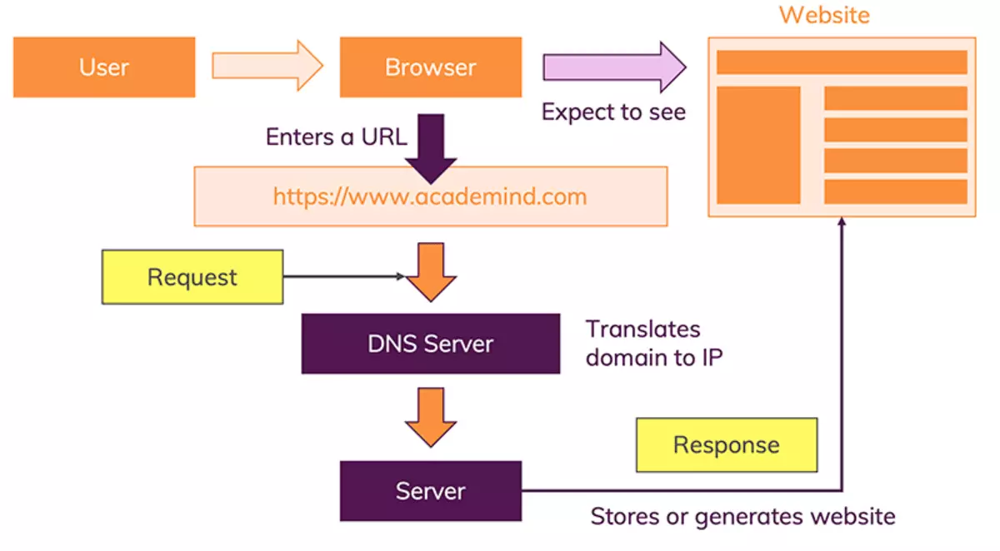
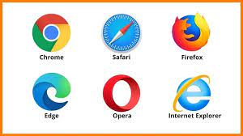

# Browsers

### **Definition:** 

A web browser is a graphical user interface (GUI) application designed to provide users with easy access to the vast information available on the World Wide Web. It serves as a user-friendly tool for navigating and interacting with online content, allowing individuals to explore websites, view multimedia, and access various online services seamlessly.

### **Working Mechanism:**
    A web browser plays a pivotal role in seamlessly connecting users to the vast expanse of information on the internet. Acting as a conduit between the user and websites, its intricate process involves fetching, rendering, and displaying content from the World Wide Web. Here's a detailed breakdown of its working mechanism:

1. #### Input:
    The browsing process initiates when a user enters a URL, clicks on a hyperlink, or requests a specific webpage.

2. #### DNS Resolution:
    The browser translates the user-friendly domain into an IP address using the Domain Name System (DNS), crucial for locating the server hosting the requested website.

3. #### HTTP Request:
    A crucial step follows as the browser sends an HTTP (Hypertext Transfer Protocol) request to the server associated with the identified IP address.

4. #### Security Measures
    To safeguard user data, the browser employs security measures such as encryption. This ensures that the information and queries provided by users remain protected from potential misuse by third parties.
4. #### Response
    With the connection established and the HTTP request processed, the browser receives a response from the server. This response comprises essential components like HTML, CSS, JavaScript, and other assets that form the web page.  

In conclusion, a web browser serves as a mediator, facilitating a smooth interaction between users and servers to deliver the desired results. Its process of fetching, rendering, and displaying content ensures an enhanced and secure browsing experience, making the vast landscape of the internet easily accessible and navigable for users.

### **Some common Web browser**
1. Chrome
2. Safari
3. Firebox              
4. Edge
5. Opera Mini
6. Internet Expolrer

